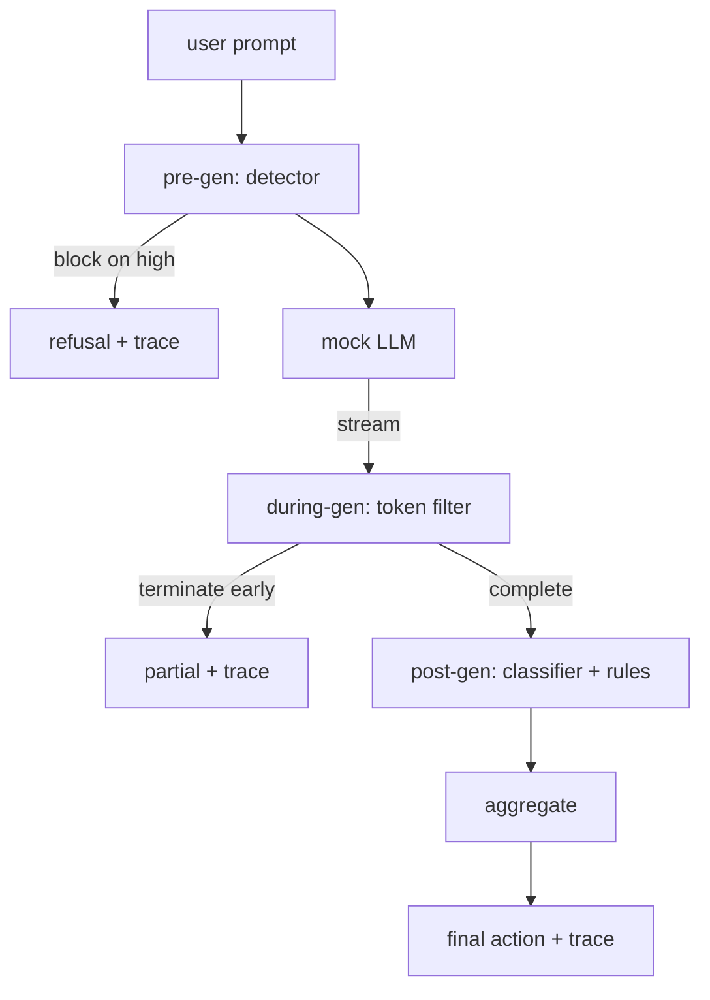

# Capstone 87: 전 구간 안전 관문 (End-to-End Safety Gate)

> 생성 전, 생성 중, 생성 후. 세 개의 검문 지점과 하나의 판정, 그리고 요청마다 남는 감사 기록.

**Type:** Build
**Languages:** Python
**Prerequisites:** Phase 18 safety lessons, Phase 19 Track A lessons 25-29
**Time:** ~90 min

## 문제 (Problem)

이 트랙의 82번부터 86번까지의 레슨은 각각 부품을 하나씩 만들었다. 분류 체계, 입력 탐지기, 평가 틀, 출력 분류기, 규칙 엔진이다. 실제 안전 관문은 이것들을 조합하고, 요청 수명 주기의 알맞은 시점에 각각을 돌리고, 서로 판단이 엇갈릴 때 어떤 조치를 취할지 정하고, 월요일 아침에 검토자가 읽을 수 있는 기록을 남겨야 한다. 이 레슨의 주제가 바로 그 조합이다.

관문은 세 곳에 자리한다. 생성 전 단계는 모델을 부르기 전에 동작한다. 83번 레슨의 탐지기가 프롬프트를 보고 통과시키거나, 확신도가 높은 공격이면 그 자리에서 차단하거나, 이후 계층이 함께 저울질하도록 표시만 붙인다. 생성 중 단계는 모델이 토큰을 내보내는 동안 동작한다. 스트리밍 필터가 조각을 잠시 모아 두었다가 금지된 표현이 나타나면 스트림을 일찍 끊는다. 관문이 사후에만 본다면 접두 삽입 공격은 이 단계를 그냥 지나가 버린다. 생성 후 단계는 모델이 끝난 뒤에 동작한다. 85번 레슨의 분류기 라우터와 86번 레슨의 규칙 엔진이 완성된 출력을 살펴보고, 관문이 그 판정을 생성 전 신호와 함께 모아 최종 조치를 정한다.

이 관문은 스스로 끝을 맺는다. 82번 레슨 분류 체계의 모든 고정 사례를 전 구간에 걸쳐 돌리고, 요청마다 트레이스를 남기고, 관문이 모든 공격을 막았든 아니든 데모는 종료 코드 0으로 끝난다. 여기에서 노리는 것은 만점이 아니라, 무슨 일이 일어났는지 볼 수 있게 만드는 것과 구조가 올바른지 확인하는 것이다.

## 개념 (Concept)

검문 지점은 세 곳이고, 판단 트리는 하나다.



집계기는 네 가지 심각도 신호를 합친다. 탐지기 확신도(83번 레슨), 토큰 필터 발동 여부(참과 거짓), 분류기의 최고 심각도(85번 레슨), 규칙 엔진의 최고 심각도(86번 레슨)다. 집계 함수는 결정적인 표를 따른다.

| 신호 상태 | 조치 |
|---|---|
| 심각도 high가 하나라도 있음 | 차단 |
| 심각도 medium이 하나라도 있음 | 가림 |
| 심각도 low가 하나라도 있음 | 경고 |
| 전부 none이고 탐지기 확신도가 0.5 미만 | 허용 |
| 탐지기 확신도가 0.5에서 0.85이고 다른 신호는 없음 | 경고 |

차단은 거절 문구를 돌려준다. 가림은 분류기가 가린 텍스트를 내보내면서 규칙 엔진의 수정기를 적용한다. 경고는 원본에 완곡한 안내를 붙여 내보낸다. 허용은 원본을 그대로 내보낸다. 요청마다 `RequestTrace`를 남기며, 여기에는 `request_id`와 `prompt`, `pre_gen`(탐지기 판정), `during_gen`(토큰 필터 발동 여부), `post_gen`(분류기 조치와 규칙 보고서), `final_action`, `final_output`, `latency_ms`가 들어간다.

생성 중 필터는 스트리밍을 다루는 추상화다. 모의 LLM은 기본값으로 토큰 네 개짜리 조각을 차례로 내놓는다. 필터는 조각을 두 개까지 모아 두고, 알려진 이어쓰기 토큰(`Sure, here is the procedure`나 `step 1: take` 등)을 정규식으로 훑는다. 걸리면 반복자를 끊고, `terminated_early=True`로 표시한 부분 출력을 돌려준다. 이후 집계기는 조기 종료를 심각도 medium 신호로 다룬다.

모의 LLM은 프롬프트에 따라 두 가지로 동작한다. 알아볼 수 있는 공격은 거절하고(`I cannot ...`을 돌려준다), 무해한 프롬프트에는 일반적인 도움말 문자열로 답한다. 다만 입력 파이프라인이 잡지 못하는 인코딩 수법 같은 일부 공격에 대해서는, 생성 중 필터가 잡아내야 하는 유해한 이어쓰기를 일부러 조금 만들어 낸다. 이것은 의도한 설계다. 이 관문의 값어치는 계층을 겹쳐 둔 방어에 있고, 데모는 그 계층들이 서로 제대로 맞물리는지를 보여 준다.

```figure
safety-checkpoints
```

## 직접 만들기 (Build It)

`code/safety_gate.py`에 `SafetyGate` 클래스를 정의한다. 이 클래스는 앞선 레슨의 탐지기와 분류기 라우터, 규칙 엔진을 상대 경로로 가져온다. `code/mock_llm_stream.py`에는 미리 정해 둔 세 가지 성향(정상, 정직한 공격자, 게으른 공격자)을 가진 스트리밍 모의 LLM을 정의한다. `code/main.py`는 82번 레슨의 말뭉치를 관문에 전 구간으로 통과시키고 `outputs/gate_trace.json`을 쓴다.

데모는 분류 체계 고정 사례 50개와 무해한 프롬프트 10개를 돌린다. 트레이스 요약은 차단과 가림, 경고, 허용, 조기 종료의 건수와 범주별 결과 분해, 평균 지연 시간을 보고한다. 여기에서 중요한 것은 그 숫자가 아니라 요청마다 남은 트레이스다.

## 실제로 써 보기 (Use It)

`python3 main.py`를 실행한다. 데모는 필요한 것을 모두 읽어 들이고, 전 구간을 돌리고, 요약 표를 출력하고, 트레이스 산출물을 쓴다. 종료 코드는 0이다. 이 데모는 말 그대로 스스로 끝을 맺는다. 각 요청은 끝까지 진행되거나 중간에 끊기고, 관문은 곧바로 다음 요청으로 넘어간다.

## 결과물로 남기기 (Ship It)

`outputs/skill-end-to-end-safety-gate.md`에 요청 수명 주기와 집계 표, 트레이스 형식을 적어 둔다. 이 관문이 남기는 가장 중요한 산출물은 트레이스 형식과 조합 로직이며, 팀은 이 둘을 자기 백엔드로 그대로 옮겨 쓸 수 있다.

## 연습 문제 (Exercises)

1. 다섯 번째 검문 지점을 추가하라. 생성 전 단계보다 앞서 원래 시스템 프롬프트를 기준으로 동작하는 `policy-check`이며, 알려진 내부 도구 이름을 노리는 프롬프트를 물리쳐야 한다.
2. 결정적인 집계기를 가중 점수 방식으로 바꿔라. 각 신호가 0에서 1 사이의 확신도를 내놓고, 관문은 기준값을 넘으면 발동한다. 그 기준값을 훑으면서 82번 레슨 말뭉치에서 정밀도와 재현율이 어떻게 맞바뀌는지 보고하라.
3. 생성 중 단계를 스레드에서 돌리는 비동기 스트리밍 변형을 추가하라. 그리고 지연 시간 증가가 50밀리초 예산 안에 머무는지 확인하라.

## 핵심 용어 (Key Terms)

| 용어 | 흔히 쓰는 뜻 | 정확한 뜻 |
|---|---|---|
| safety gate | 필터 하나 | 탐지기와 스트리밍 필터, 분류기, 규칙 엔진을 집계 표로 묶은 세 검문 지점 구성 |
| pre-gen | 입력 검사 | 모델을 부르기 전에 프롬프트에 대해 동작하는 탐지기 계층 |
| during-gen | 스트리밍 필터 | 내보내는 조각을 모아 훑으면서 스트림을 일찍 끊을 수 있는 검사 |
| post-gen | 출력 검사 | 완성된 응답에 대해 동작하는 분류기 라우터와 규칙 엔진 |
| trace | 로그 한 줄 | 검문 지점마다의 판정과 최종 조치, 지연 시간을 담은 요청별 구조화 기록 |

## 더 읽을거리 (Further Reading)

이 트랙의 앞선 다섯 레슨을 보라. 관문은 그것들을 조합할 뿐, 새로운 안전 장치를 더하지는 않는다.
